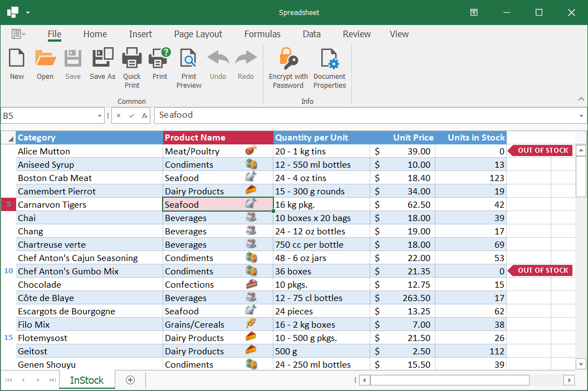

<!-- default badges list -->

<!-- default badges end -->
<!-- default file list -->
*Files to look at*:

* [Form1.cs](./CS/WindowsFormsApp1/Form1.cs) (VB: [Form1.vb](./VB/CustomDrawExample/Form1.vb))
<!-- default file list end -->
# WinForms Spreadsheet - How to Use Custom Draw Events to Customize the Appearance of Spreadsheet Elements

This example demonstrates how to use custom draw events to customize the appearance of worksheet cells, and row and column headers. These events allow you to display custom text, change background settings, or draw images and geometric primitives (lines, rectangles, callouts, and so on) over spreadsheet elements. 

