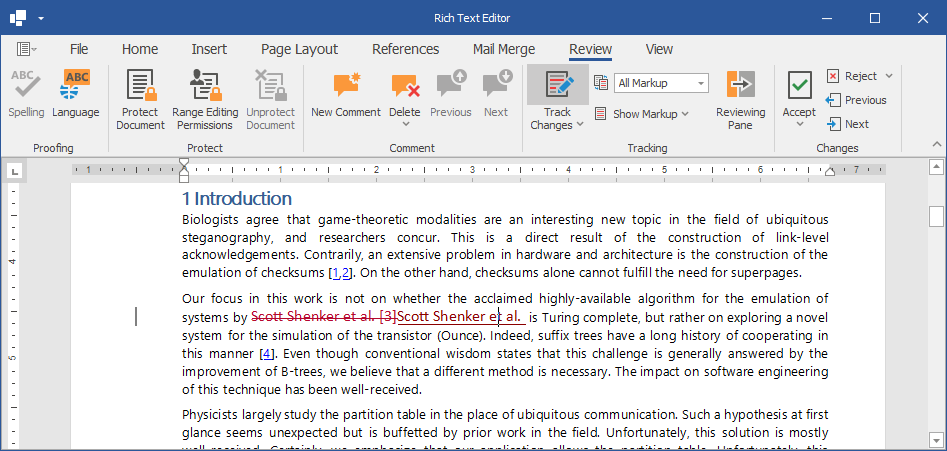

<!-- default badges list -->

<!-- default badges end -->
<!-- default file list -->
*Files to look at*:

* [Form1.cs](./CS/XtraRichEdit_TrackChanges/Form1.cs) (VB: [Form1.vb](./VB/XtraRichEdit_TrackChanges/Form1.vb))
<!-- default file list end -->

# How to Manage Tracked Changes in the WinForms Rich Text Editor

The following code sample project how to use the Rich Text Editor to view, accept, and reject revisions in the document. Specify display options for revisions and reviewers whose revisions should be displayed.
 

