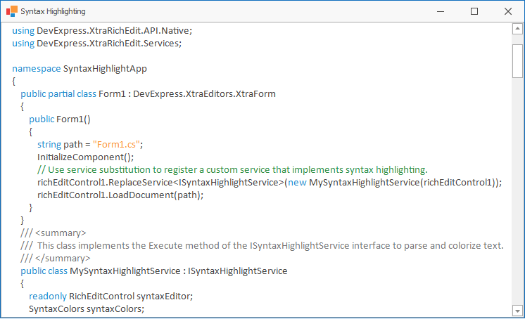

<!-- default badges list -->

<!-- default badges end -->

# Rich Text Editor for WinForms - Implement ISyntaxHighlightService to Highlight C# and VB Code Syntax

The [Rich Text Editor](https://docs.devexpress.com/WindowsForms/4946/controls-and-libraries/rich-text-editor) supports [ISyntaxHighlightService](https://docs.devexpress.com/OfficeFileAPI/DevExpress.XtraRichEdit.Services.ISyntaxHighlightService) that allows you to implement syntax highlighting for a document displayed in the control. This example demonstrates how to highlight its source code (C# and VB). The project uses the **DevExpress CodeParser** library to parse the code into tokens according to the syntax elements of the programming language.

## Implementation Details

1.	Declare a custom class that implements [ISyntaxHighlightService](https://docs.devexpress.com/OfficeFileAPI/DevExpress.XtraRichEdit.Services.ISyntaxHighlightService). In the class constructor, specify colors for different code element categories (keywords, comments, strings, and so on). This example uses colors of the current application skin.
2.	Implement the [ISyntaxHighlightService.Execute](https://docs.devexpress.com/OfficeFileAPI/DevExpress.XtraRichEdit.Services.ISyntaxHighlightService.Execute) method. Within the method, use parsers from the **DevExpress CodeParser** library to parse C# and VB source code into tokens.
3.	Convert tokens to the [SyntaxHighlightToken](https://docs.devexpress.com/OfficeFileAPI/DevExpress.XtraRichEdit.API.Native.SyntaxHighlightToken) objects and specify format settings for each token. 
4.	Pass the list of [SyntaxHighlightToken](https://docs.devexpress.com/OfficeFileAPI/DevExpress.XtraRichEdit.API.Native.SyntaxHighlightToken) objects to the [SubDocument.ApplySyntaxHighlight](https://docs.devexpress.com/OfficeFileAPI/DevExpress.XtraRichEdit.API.Native.SubDocument.ApplySyntaxHighlight(System.Collections.Generic.List-DevExpress.XtraRichEdit.API.Native.SyntaxHighlightToken-)) method to enable syntax highlighting in the document. 
5.	Call the [RichEditControl.ReplaceService\<T>](https://docs.devexpress.com/WindowsForms/DevExpress.XtraRichEdit.RichEditControl.ReplaceService--1(--0)) method to register the custom [ISyntaxHighlightService](https://docs.devexpress.com/OfficeFileAPI/DevExpress.XtraRichEdit.Services.ISyntaxHighlightService) implementation.

## Files to Look At

[Form1.cs](./CS/SyntaxHighlightApp/Form1.cs) (VB: [Form1.vb](./VB/SyntaxHighlightApp/Form1.vb))

## Documentation

[Highlight Document Syntax](https://docs.devexpress.com/WindowsForms/12107/controls-and-libraries/rich-text-editor/examples/automation/how-to-highlight-document-syntax)

## More Examples

[How to: Create Syntax Highlight Tokens to Highlight T-SQL Language Syntax](https://supportcenter.devexpress.com/ticket/details/e4139/how-to-implement-t-sql-language-syntax-highlighting-by-creating-syntax-highlight-tokens)
